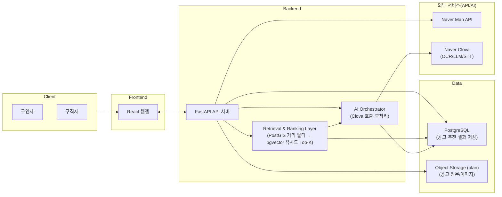

# ilowa (Public Portfolio Snapshot)

**ilowa는 시니어가 소일거리를 더 쉽게 구인·구직할 수 있도록 만든 웹 서비스**입니다.  
전단지·전화처럼 비정형으로 흩어진 공고를 **OCR/STT로 등록 자동화 → DB 정형화 → 추천/검색**으로 연결해, 실제 서비스 흐름에서 데이터가 쌓이고 활용되도록 설계했습니다.

> 이 저장소는 **공개 포트폴리오 스냅샷**으로, 실데이터/비밀키/캐시를 포함하지 않습니다.  
> 데모는 `AI_MODE=NO_KEY` 기본값으로 동작하며, **외부 API 호출 없이** `ai_modeling/data_samples`의 가짜 샘플 시드 + 로컬 임베딩 생성만으로 재현됩니다.


---
## Demo


## Architecture

### Service Architecture


## Quickstart
```bash
cp .env.example .env
make scan
make demo
```

기본 포트는 API 18000 / DB 15432 입니다.  
충돌 시 `.env`에서 `API_PORT`와 `DB_PORT`를 원하는 값으로 변경하세요.  
DB_PORT는 호스트 publish 포트이며 컨테이너 내부 통신은 항상 `db:5432`입니다.

## Team & Attribution (R&R)

> 팀 프로젝트이며, 각자 메인 오너십이 있는 영역 외에도 일부 기능은 협업/크로스 기여로 완성했습니다.

### TL;DR
- **@grkygrt1476 — Backend / AI Orchestration / Infra (Main)**: API·DB·Docker·Alembic·seed/embedding 파이프라인·클린룸 재현성
- **@watersu916 — Frontend / OCR (Main) + Cloud/Infra (Partial)**: UI·OCR 입력 플로우 + 배포/운영 설정 일부 지원
- **@jwendykim — AI Modeling / STT (Main) + Backend (Partial)**: STT/모델링 파이프라인 + API 연동/서버 로직 일부 지원
- **Planning/Coordination (Shared):** 문제 정의, MVP 스코프/데모 시나리오 확정, API/데이터 계약 합의 및 주간 싱크로 일정 조율

### Roles (Detailed)

#### @grkygrt1476 — Backend / AI Orchestration / Infra (Main)
- FastAPI 백엔드 API 설계/구현, 엔드포인트/응답 스키마 정리
- Postgres + PostGIS + pgvector 기반 데이터/검색 구조 구성
- Docker Compose 기반 로컬 데모/클린룸 재현성(`make scan`, `make demo`)
- Alembic 마이그레이션 체인 정리(단일 head), 시드/임베딩 생성·적재 자동화

#### @watersu916 — Frontend / OCR (Main) + Cloud/Infra (Partial)
- 프론트엔드 UI/UX 구현 및 사용자 플로우 구성(등록/조회 등)
- OCR 입력 기능(이미지→텍스트 추출) 파이프라인 구현 및 화면/백엔드 연동
- (Partial) 데모/배포 과정에서 운영/클라우드 설정 일부 지원
  - 예: 환경변수/포트 이슈 트러블슈팅, 컨테이너 실행 확인, 배포 리허설 지원 등

#### @jwendykim — AI Modeling / STT (Main) + Backend (Partial)
- STT 입력 기능(음성→텍스트) 파이프라인 구현 및 백엔드 연동
- AI 모델링/전처리(텍스트 정제/요약 등) 및 데모 데이터 품질 개선
- (Partial) 백엔드 연동/유틸 일부 기여
  - 예: AI 결과 어댑터/유틸, 시드 파이프라인 연동 보조, 간단한 API 보조 구현 등

> NOTE: “Main/Partial” 표기는 오너십(주담당)과 협업 기여(부분 참여)를 구분하기 위한 표기입니다.

## Recognition
- 🏆 AI-Challenge 2기 우수상 (2025.11) — 과학기술정보통신부/NIA
- 🎓 Mentoring: Naver Cloud (2025.09~2025.11)

## Cleanroom routine (원본 → 클린룸)
(A) `~/ilowa`: 수정/커밋  
(B) `/tmp/t`: clone + `.env` 생성 + `make demo`

```bash
cd /tmp
rm -rf t
git clone --no-local /home/kihun/ilowa t
cd t
cp .env.example .env

WANT_WHERE=1 make scan
# 기본 포트 충돌 시 예: API_PORT=18001 로 변경 가능
API_PORT=18000 DB_PORT=15432 WANT_WHERE=1 make demo
```

## Port publish 확인
```bash
API_PORT=18000 DB_PORT=15432 HOST_UID=$(id -u) HOST_GID=$(id -g) \
  docker compose -f docker-compose.yml config | grep -nE 'published:|target:'
```

## DB 환경값 확인
```bash
docker compose exec -T api sh -lc 'env | egrep "POSTGRES_HOST|POSTGRES_PORT|DB_PORT|DATABASE_URL" | sort'
```

## Proof (실행 확인)
```bash
curl -s http://localhost:18000/health && echo
curl -s "http://localhost:18000/api/v1/jobs?per_page=3" | head
```

## Frequently used
```bash
make scan
make demo
make logs
make down
```

## Demo seed / embeddings
시드는 `ai_modeling/data_samples/demo_jobs_50.json`을 사용합니다.

임베딩은 `make seed` 또는 `make demo` 실행 중 로컬에서 생성/적재됩니다.

## Troubleshooting (Quick)
- Port already allocated: `API_PORT=18001 make demo`
- Reset demo env: `make down && make demo`

## Deep dive docs
Start here: [`docs/overview.md`](docs/overview.md) — index for detailed docs and reading order.

Recommended order:
1. [`docs/overview.md`](docs/overview.md) — entry point and map of the docs.
2. [`docs/architecture.md`](docs/architecture.md) — system design and components.
3. [`docs/deploy.md`](docs/deploy.md) — deployment architecture diagram and local demo/cleanroom notes.
4. [`docs/k8s.md`](docs/k8s.md) — optional Kubernetes notes.
5. [`docs/ai.md`](docs/ai.md) — AI flows (posting pipeline + retrieval/ranking), NO_KEY vs KEY modes.
6. [`docs/frontend.md`](docs/frontend.md) — frontend flows and local run notes.
7. [`docs/troubleshooting.md`](docs/troubleshooting.md) — minimal checklist (TBD).

## Contact
- GitHub: https://github.com/grkygrt1476
- Email: grkygrt1476 [at] naver [dot] com
