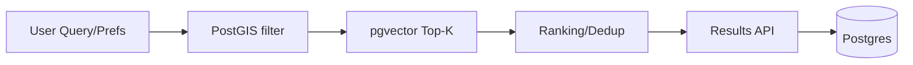

# AI Deep Dive (Portfolio Snapshot)

This snapshot keeps AI behavior demo-friendly: posting automation (OCR/STT inputs to a
structured job post) and retrieval/ranking (PostGIS + pgvector). The README stays short;
this page keeps the flow high-level and verifiable.

## AI Flows (High-level)
```mermaid
flowchart LR
  IN[Input] --> OPT[OCR/STT (optional)]
  OPT --> NORM[Parse/Normalize]
  NORM --> VAL[Validation Gate]
  VAL --> WR[DB Writer]
  WR --> PG[(Postgres)]
  PG --> API[API Response]
```



## Demo Modes
- NO_KEY: sample seed + local embedding generation, no external API calls.
- KEY (optional): external OCR/STT/LLM/Embedding providers if env keys exist.

## Where to look in code
- `ai_modeling/orchestration/pipeline.py` — provider-based flow orchestration.
- `ai_modeling/agents/posting_agent.py` — posting automation logic.
- `ai_modeling/agents/react_agent.py` — recommendation loop (high-level).
- `backend_api/app/api/v1/jobs.py` — retrieval endpoints and ranking outputs.
