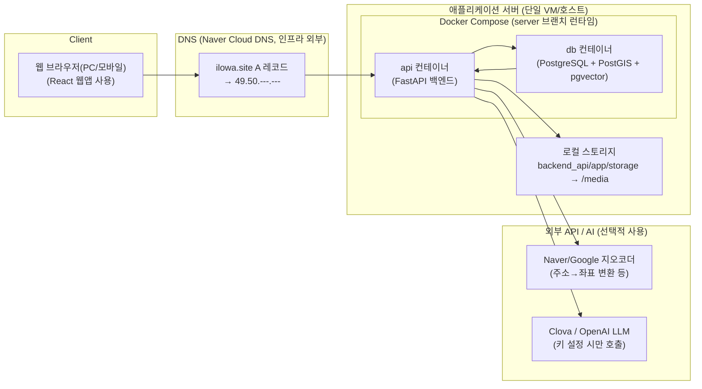

# Deployment Deep Dive (Portfolio Snapshot)

This page captures the deployment view for the public snapshot.
The diagram shows how the local demo/cleanroom setup maps containers and external APIs.
It does not include production secrets or credentials.

## Deployment Architecture (Local Demo / Cleanroom)

## Local Demo Notes
- Docker Compose runs the api/db containers for local demo and cleanroom runs.
- Published ports default to API 18000 and DB 15432 (override via env).
- Internal DB connections use `db:5432`.
- Cleanroom routine is described in the README.
